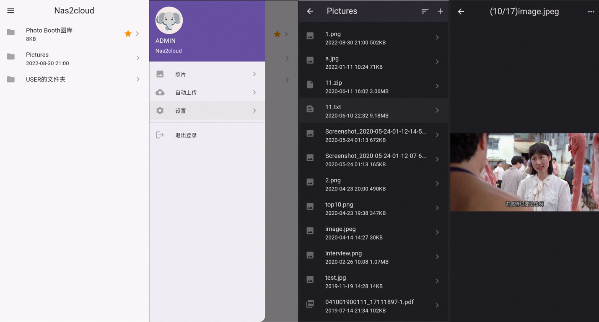

Nas2cloud，个人NAS系统，提供文件和照片管理功能。  
Nas2cloud，A personal NAS system for file and photo management.

服务端使用golang开发  
可以运行在Windows、Macos、Linux，在低性能的个人电脑上可以提供较快的访问速度

The server is developed using golang  
It can run on Windows, Macos, and Linux, and can provide faster response speed on low-performance computers.

客户端使用flutter开发，已适配android 12+，支持文件及照片查看及自动上传。

The client is developed using flutter, and has been adapted to android 12+, supporting file and photo viewing and
automatic uploading.

## 安装

### 依赖中间件

1. [redis](https://hub.docker.com/_/redis)
2. [elasticsearch](https://hub.docker.com/_/elasticsearch)

### 其他依赖：

1. [ffmpeg](https://ffmpeg.org/download.html) 用来生成照片缩略图
2. du命令，获取文件夹大小，windows下需要单独安装 [du for windows](https://learn.microsoft.com/en-us/sysinternals/downloads/du)

### 执行安装

1. 执行 `./nas2cloud config --profile prod` 生成配置文件模板，按需修改配置文件

- prod/bucket.json 本地目录映射配置
- prod/users.json 用户配置文件
- prod/redis.json redis连接配置
- prod/es.json elasticsearch连接配置

2. 执行 `./nas2cloud start --profile prod` 启动程序

3. 访问 `http://localhost:8080/app/` 可在浏览器使用WEB版本客户端
